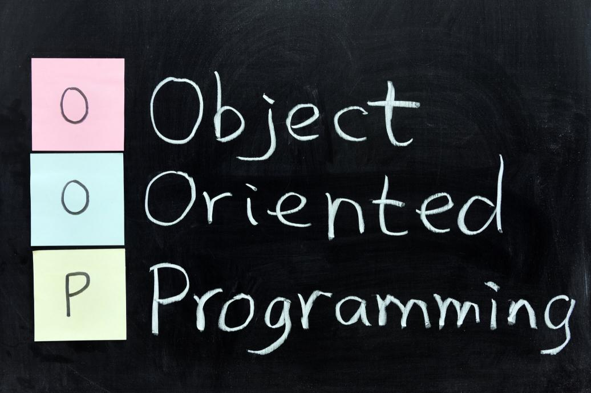
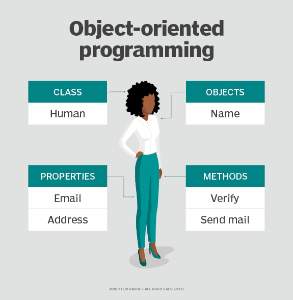
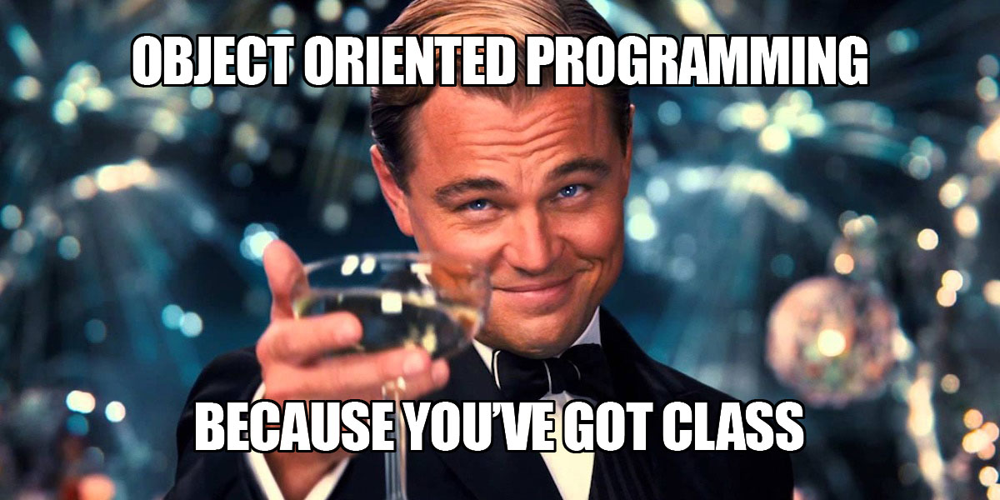
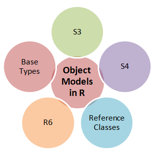

```{r setup, include=FALSE}
options(htmltools.dir.version = FALSE)
```

class: inverse, center, middle

# To keep in touch ! 

<a href="mailto:criscelylujan@gmail.com"><i class="fa fa-paper-plane fa-fw"></i>&nbsp;Personal email: criscelylujan@gmail.com</a><br>
<a href="mailto:criscely.lujan@ird.fr"><i class="fa fa-paper-plane fa-fw"></i>&nbsp; Profesional email: criscely.lujan@ird.fr</a><br>
<a href="http://twitter.com/CriscelyLP"><i class="fa fa-twitter fa-fw"></i>&nbsp; Twitter: @CriscelyLP</a><br>
<a href="http://github.com/CriscelyLP"><i class="fa fa-github fa-fw"></i>&nbsp; GitHub: @CriscelyLP</a><br>


---

background-image: url("https://media.giphy.com/media/l0IyjiXOXTX6Yemsg/giphy.gif")
background-position: 50% 50%
class: center, inverse
background-size: 800px

---

background-image: url("https://media.giphy.com/media/yeorocc1eT9Cj50HRK/giphy.gif")
background-position: 50% 50%
class: center, inverse
background-size: 900px

---

# OOP?

```{r, echo=FALSE, out.width = "600px", fig.align='center', fig.cap="www.roberthalf.com"}

```

---

# In a OOP system ...

<br>
--

- Programmers define a data type of a data structure (`object`),

<br>
--

- Types of operations (`methods`) that can be applied to the data structure. 

<br>
--

- All objects with the same attributes and behavior are grouped into collections (`classes`)

---

```{r, echo=FALSE, out.width = "500px", fig.align='center', fig.cap="Techtarget"}


```

# OOP representation

---

# OOP in R


```{r, echo=FALSE, out.width = "700px", fig.align='center'}


```

<br>
--

- `R` has four OOP implementations: S3, S4, RC (reference classes) and R6.

--

- `Base type` system is not a OOP !

---

# OOP in R

```{r, echo=FALSE, out.width = "300px", fig.align='center'}


```

--

- S3 is the `simplest OOP` system in R

--

- Most `commonly` used system in CRAN packages

--

- The only OOP system used in the `base` and `stats` packages

(Wickham, 2014)

---

# Recognising objects

- An easy way to recognise objects is by the use of the package `pryr`.

--

```{r, eval = TRUE, message=FALSE}
library(pryr)
```

--

```{r, eval = TRUE}
# We create a data as an example:
data = data.frame(x = 1:10, y = letters[1:10])
str(data)
```

---

# Recognising objects

- The `otype` function determine the object type

--

```{r, eval = TRUE}
otype(data) # The data frame is an S3 class
```

--

```{r, eval = TRUE}
otype(data$x) # A vector is not S3
```

--

```{r, eval = TRUE}
otype(data$y) # A factor is S3
```

---

# Exploring classes

- By the use of the function `class`

--

```{r, eval = TRUE}
class(data) 
```
--

```{r, eval = TRUE}
class(data$x) 
```

--

```{r, eval = TRUE}
class(data$y) 
```

---

# Using generic functions

--

- In S3 methods belong to functions called `generic functions`.

--

- To determine if a function is a S3 generic, you can inspect its source code for a call to `UseMethod()`.

--

- `ftype` also describe the function type.

--

```{r, eval=TRUE}
mean
```

--

```{r,eval=TRUE}
ftype(mean) # S3 generic function for the arithmetic mean
```

---

# Calling methods!

- Given a class, the job of an S3 generics is to call the right `S3 method`

--

- You can see all the methods that belong to a generic with `methods()`

```{r, eval=TRUE}
methods("mean")
```

--

```{r, eval=TRUE}
methods("plot")
```

---

```{r, eval=TRUE}
methods("print") # Needing more space ! :) 
```

---

background-image: url("https://media.giphy.com/media/l0IynFzUXseFwySZi/giphy.gif")
background-position: 50% 50%
class: center, inverse
background-size: 900px

# ... Almost ready!

---

# Some concluding remark

--
- OOP is important for all R users.

<br>
--

- If you use R, for SURE you were using classes, methods, and generics! (`OOP system`)

<br>
--

- Not all R packages use OOP system! :(

<br>
--

- Always there are new things to learn! 

<br>
--

- Are you creating a new package? Let's use this time OOP! 💜 ...

#... this will make life easier for users !

---

background-image: url("https://media.giphy.com/media/28fbJdiSmVEpyewYE9/giphy.gif")
background-position: 50% 50%
class: center, inverse
background-size: 600px

---

# Thanks!

- [R-Ladies Freiburg](https://twitter.com/RLadiesFreiburg) for the invitation.

- [R-Ladies Montpellier](https://twitter.com/RLadiesMontpel) for the co-organization.

<br> 

```{r, echo=FALSE, out.width = "300px", fig.align='center'}

```

---

# Bibliography

- [A. C. Kak. `Programming with Objects: A Comparative Presentation of Object-Oriented Programming With
C++ and Java`. John Wiley and Sons, Inc, 2003](https://doi.org/10.1109/9780470547144).

- J. M. Garrido. `Object-oriented programming: from problem solving to Java`. Charles River Media, 1 edition,
2003.

- [I. D. Craig. `Object-oriented programming languages: Interpretation`. 8, 2007](https://doi.org/
10.1007/978-1-84628-774-9)

- H. Wickham. `Advanced R`. Chapman and Hall/CRC, first edition edition, 2014. ISBN13: 978-1466586963.

- H. Wickham. `Advanced R`. Chapman and Hall/CRC, second edition edition, 2019. ISBN13: 978-0815384571.
